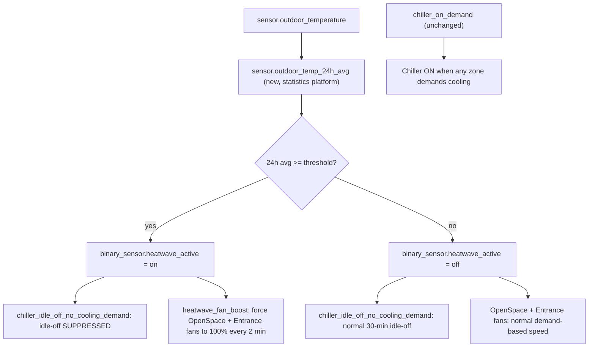

# Heat-wave chiller + OpenSpace/Entrance fan boost

## Context

OpenSpace and Entrance are struggling to reach/hold target temperature on the
current hot days. Live check of the NAS today found the chiller is currently
governed by only two active automations:

| Automation | Behavior |
|---|---|
| `chiller_on_demand` | Turns chiller on when any zone actively demands cooling |
| `chiller_idle_off_no_cooling_demand` | Turns chiller off after 30 min with no zone demanding cooling |

The dedicated overnight/weekend safety-off and pre-start automations
(`chiller_safety_off_non_workday`, `chiller_pre_start_warm_forecast_morning`,
`chiller_end_of_day_off`) are currently **orphaned** (`unavailable` — not in
the loaded config). Both `fancoil_speed_control` automations that map VT
demand to ESP32 fan speed are also currently orphaned; fan speed on
OpenSpace/Entrance appears to still track demand, most likely handled
on-device by the ESPHome firmware rather than a HA-side automation.

## Proposed change

1. Add `sensor.outdoor_temp_24h_avg` — a native HA `statistics` sensor
   (mean, 24h window) over `sensor.outdoor_temperature`. No custom code;
   this is a built-in HA platform.
2. Add `input_number.chiller_heatwave_threshold` — an editable helper
   (default 26.0°C, range 22–32, step 0.5) so the trigger point can be
   tuned from the dashboard without a code change.
3. Add `binary_sensor.heatwave_active` — a template sensor: on when the
   24h average is at or above the threshold.
4. Modify `chiller_idle_off_no_cooling_demand` to add a condition: only
   idle-off the chiller when `heatwave_active` is `off`. `chiller_on_demand`
   is unchanged — the chiller still only ever turns on because a real zone
   is demanding cooling, it just stops turning back off after 30 idle
   minutes while the heat wave is active.
5. Add a new automation, `heatwave_fan_boost`, that forces
   `fan.set_percentage: 100` on OpenSpace's two fans
   (`fan.fancoilcontroller_01_fancoil`, `fan.fancoil_02_fancoil`) and
   Entrance's fan (`fan.fancoil_03_fancoil`) whenever that zone is in `cool`
   mode and `heatwave_active` is on — reasserted every 2 minutes as a
   belt-and-suspenders in case anything else tries to throttle them back
   down. No new automation needed to "revert" — once `heatwave_active`
   clears, this automation simply stops intervening and whatever normally
   modulates the fans resumes on its own next cycle.

Decision: Chiller stays on through a detected heat wave (24h avg temp ≥
threshold) instead of idling off after 30 min with no demand — trigger is
weather-based, not a manual toggle or fixed calendar season.

Decision: OpenSpace and Entrance fans run unconditionally at 100% (not
demand-aware) whenever those zones are in cool mode during a detected heat
wave — matches the literal ask over a "raise the floor, stay demand-aware"
alternative, since the whole reason for this change is that demand-based
modulation isn't keeping these two rooms comfortable.

## Current vs proposed flow

## Risks / trade-offs

| Risk | Mitigation / acceptance |
|---|---|
| Continuous chiller runtime raises energy cost during the heat wave | Accepted — chiller still only turns on from real demand (`chiller_on_demand` unchanged); this only removes the 30-min idle-off during a detected heat wave, not an unconditional 24/7 override |
| OpenSpace/Entrance fans at max speed continuously = more noise + relay wear + energy, even once momentarily comfortable | Accepted per your explicit choice (unconditional 100% over demand-aware floor-raise) |
| `fancoil_speed_control` automations are already orphaned — root cause of why current modulation may be inconsistent is not fully understood | Out of scope for this change; the new `fan.set_percentage` override is a direct assertion that doesn't depend on understanding what (if anything) currently drives these fans, so it works regardless |
| Threshold (26.0°C 24h avg) is a first guess, not yet tuned against a real observed heat wave | Exposed as an editable `input_number` — adjust from the dashboard, no code change needed |

## Rollout

1. Deploy the 4 new helpers/sensors + modified chiller automation +
   new fan-boost automation via the normal git → bundle → check_config →
   restart runbook.
2. Verify `binary_sensor.heatwave_active` computes correctly against live
   data before relying on it (dry-run check against current 24h temp
   history).
3. Watch the first real activation live (fan percentages actually pin at
   100, chiller stays on past a 30-min no-demand window) before considering
   this done.
