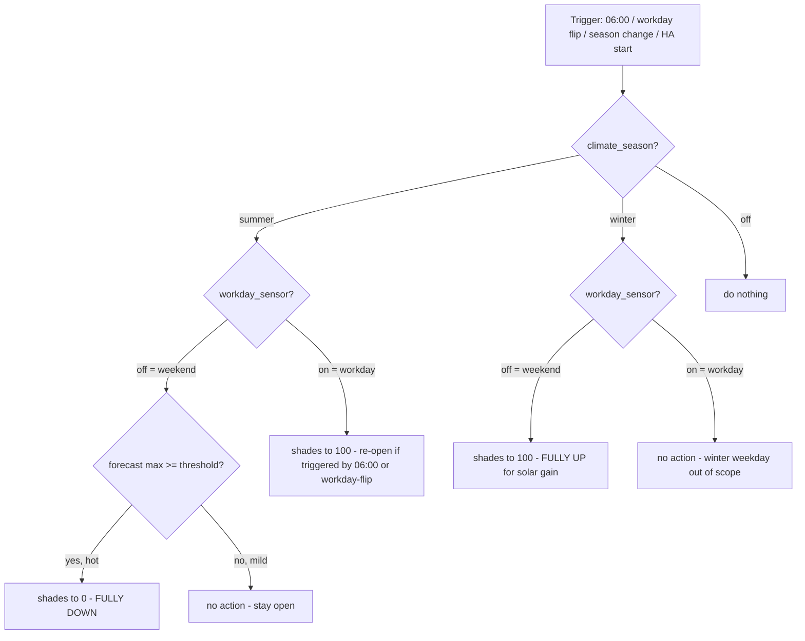

# Weekend Sun-Shade Override

## Goal

Add a weekend rule on top of the existing per-room intelligent sun-shade automation: in high-summer keep the shades fully DOWN over the weekend to keep the empty building cool; in winter keep them fully UP over the weekend so the low sun warms the rooms for free. Weekday behaviour is unchanged.

## Decisions (locked with you)

Decision: "Weekend" = any non-workday — Saturday, Sunday AND Italian public holidays — read from the existing `binary_sensor.workday_sensor` (off = unoccupied), the same sensor the climate automations already use.

Decision: In summer the weekend close only fires when it is actually hot — today's forecast max ≥ `input_number.shade_forecast_max_threshold` (the existing helper). A cool/rainy summer weekend leaves the shades open.

Decision: "Fully down" = cover position 0 (fully closed, max heat block) and "fully up" = position 100 (fully open, max solar gain) — more than the weekday partial "closed" helper of 30.

## How it fits today's system

All three shades — Meeting (`cover_0`) and CS (`cover_1`) on the shared Shelly `34987a47c9b0`, and Mensa (`cover_0`) on Shelly `2cbcbbb1ff9c` — run one `intelligent_sun_shade` blueprint. That blueprint is already summer-only (hard-skipped in winter) and runs every day on sun-azimuth / elevation / room-temperature / cloud logic. It has no concept of weekend, so on summer weekends it keeps fiddling the shades around an empty building, and in winter it does nothing at all.

## Changes

1. Guard the `intelligent_sun_shade` blueprint to workdays only — add a `binary_sensor.workday_sensor` is `on` condition next to the existing not-winter condition, so the intelligent logic stands down on every non-workday and never fights the weekend hold. One edit, applies to all three rooms.

2. Add a new standalone automation `weekend_shade_hold` that owns the shades on non-workdays and resets them on workday mornings, per the decision table below.

3. Verify with `python3 -c "import yaml…"`, commit + push, then on the NAS `git pull` + Reload Automations. No restart needed.

## Target position by state

Decision: The new automation sets shade position from season + occupancy as follows:

| season | day | hot forecast | shades go to |
|---|---|---|---|
| summer | non-workday | yes | 0 — fully down |
| summer | non-workday | no | no action (stay open) |
| winter | non-workday | — | 100 — fully up |
| summer | workday | — | 100 — re-open, hand back to blueprint |
| winter | workday | — | no action (out of scope) |
| off | — | — | no action |

## Behaviour flow



## Edge cases handled

1. Monday after a hot weekend: the shades are at 0; the 06:00 trigger (and the weekend→workday flip) re-opens them to 100 so the blueprint takes over from a clean state.
2. A weekend that turns hot on day 2: the next 06:00 re-evaluates the forecast and closes.
3. HA restart mid-weekend: the `homeassistant start` trigger re-asserts the hold (down in hot summer, up in winter).
4. HA restart mid-day on a workday will NOT fling shades open — the "re-open" branch only runs on the 06:00 or workday-flip triggers, not on startup/season changes, so a hot-afternoon restart can't undo the blueprint's heat close.
5. Cool summer weekend: no branch fires, blueprint is guarded off, shades simply stay where Friday left them (open).

## New automation (exact YAML to be added)

```yaml
- id: weekend_shade_hold
  alias: Sun Shade — Weekend Hold (summer down / winter up)
  description: >
    Non-workday shade override sitting on top of the per-room
    intelligent_sun_shade blueprint (which is guarded to workdays only).
    Summer + hot forecast -> all shades FULLY DOWN (0); winter -> all shades
    FULLY UP (100). On workday mornings re-opens (100) so a weekend full-close
    is cleared before the blueprint resumes.
  mode: single
  triggers:
    - trigger: time
      at: "06:00:00"
      id: morning
    - trigger: state
      entity_id: binary_sensor.workday_sensor
      id: workday_change
    - trigger: state
      entity_id: input_select.climate_season
      id: season_change
    - trigger: homeassistant
      event: start
      id: startup
  conditions: []
  actions:
    - choose:
        # Summer + weekend + hot -> fully down
        - conditions:
            - condition: state
              entity_id: input_select.climate_season
              state: summer
            - condition: state
              entity_id: binary_sensor.workday_sensor
              state: "off"
            - condition: numeric_state
              entity_id: input_number.shade_today_outdoor_max_forecast
              above: input_number.shade_forecast_max_threshold
          sequence:
            - action: cover.set_cover_position
              target:
                entity_id:
                  - cover.shellypro2cover_34987a47c9b0_cover_0
                  - cover.shellypro2cover_34987a47c9b0_cover_1
                  - cover.shellypro2cover_2cbcbbb1ff9c_cover_0
              data:
                position: 0
            - action: logbook.log
              data:
                name: "Weekend Sun Shade"
                message: "Weekend hot summer day - all shades fully down (0)"
        # Winter + weekend -> fully up
        - conditions:
            - condition: state
              entity_id: input_select.climate_season
              state: winter
            - condition: state
              entity_id: binary_sensor.workday_sensor
              state: "off"
          sequence:
            - action: cover.set_cover_position
              target:
                entity_id:
                  - cover.shellypro2cover_34987a47c9b0_cover_0
                  - cover.shellypro2cover_34987a47c9b0_cover_1
                  - cover.shellypro2cover_2cbcbbb1ff9c_cover_0
              data:
                position: 100
            - action: logbook.log
              data:
                name: "Weekend Sun Shade"
                message: "Weekend winter day - all shades fully up (100) for solar gain"
        # Workday + summer, only on 06:00 or workday-flip -> re-open and hand back to blueprint
        - conditions:
            - condition: state
              entity_id: input_select.climate_season
              state: summer
            - condition: state
              entity_id: binary_sensor.workday_sensor
              state: "on"
            - condition: template
              value_template: "{{ trigger.id in ['morning', 'workday_change'] }}"
          sequence:
            - action: cover.set_cover_position
              target:
                entity_id:
                  - cover.shellypro2cover_34987a47c9b0_cover_0
                  - cover.shellypro2cover_34987a47c9b0_cover_1
                  - cover.shellypro2cover_2cbcbbb1ff9c_cover_0
              data:
                position: 100
```

## Blueprint guard (exact edit)

```yaml
# intelligent_sun_shade.yaml — conditions: block becomes
conditions:
  - condition: not
    conditions:
      - condition: state
        entity_id: input_select.climate_season
        state: winter
  - condition: state            # NEW: stand down on non-workdays
    entity_id: binary_sensor.workday_sensor
    state: "on"
```
